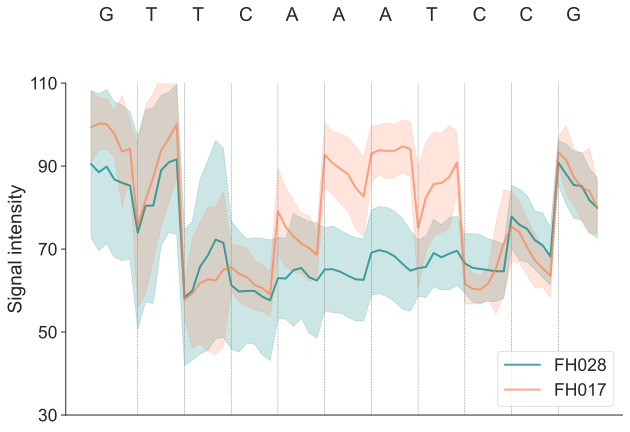

# MoDorado (off-label modification detection by repurposing Dorado models)
[](https://doi.org/10.1093/nar/gkaf795)

MoDorado is a light-weight algorithm that detects modification by off-label use of pre-trained modification-specific models in nanopore direct RNA sequencing (**SQK-RNA004**). The main features include the following:

- Directly utilizing the basecalling output from Dorado
- Supporting **A/U/C** bases (corresponding to the currently availalbe m6A/Ψ/m5C models for RNA004)
- **Off-label** predictions for modifications beyond the existing models by comparing prediction score distributions 

The current version of MoDorado supports analysis of tRNA modifications, with future extensions planned for mRNA and other types of RNAs.

## Installation
To install MoDorado, you need Python >= 3.10 and ideally a dedicated virtual environment via conda/mamba to avoid conflicts.
```
conda create --name modo_env python=3.10
conda activate modo_env
```

To install, run
```
git clone https://github.com/KleistLab/MoDorado.git
cd MoDorado
pip install .
```

## Quick start 
Here we show a quick toy example with two small samples in the tests folder, starting from parsing dorado model predictions (Step 2). The preprocessing steps require the original dorado basecalls, which exceed github's file size limits.
```
mkdir tests/output

# To compute KL divergence between two samples
modorado parse_dorado -r tests/data/reference.fasta -s FH028,FH017 -a tests/data/FH028_parasail_reference_filtered_fulllen.sam tests/data/FH017_parasail_reference_filtered_fulllen.sam -o tests/output/trna2mods.pckl
modorado compare -p tests/output/trna2mods.pckl -r tests/data/reference.fasta -a tests/data/20241031_data_shifted_mods.xlsx -s FH028,FH017 --cov 100 -o tests/output/kl_symmetric_mincov100_test.tsv

# To plot signals between two samples at a certain position  
modorado extract_signal --sample FH017,FH028 -a tests/data/FH017_parasail_reference_filtered_fulllen.sam tests/data/FH028_parasail_reference_filtered_fulllen.sam --ref tests/data/reference.fasta --pod5_dir tests/data/ --subsample 200 -o tests/output/signals_FH017,FH028_200.pckl
modorado plot --sample1 FH028 --sample2 FH017 --signals tests/output/signals_FH017,FH028_200.pckl --trna tRNA-Cys-GCA-1-1 --pos 58 --kmer 11 --annotation tests/data/SI_table1.xlsx -o tests/output/FH028_FH017_Cys-GCA-1_11mer.svg 
```

## 1. Preprocessing 
### 1.1 Basecalling and modification calling with Dorado models
First, we perform basecalling and modification calling [Dorado](https://github.com/nanoporetech/dorado). Currently, the latest basecalling model for RNA004 is `rna004_130bps_sup@v5.1.0`, with the four models for m6A/Ψ/m5C/inosine selected. Additionally, for further processing (e.g. signal visualisation), the options `--emit-moves --emit-sam` should be used.


### 1.2 Alignment and read filtering (currently tRNA-specific)
To run [Parasail](https://github.com/jeffdaily/parasail), we first need to convert `.sam` output from Dorado by `samtools fastq -T "*" basecalls.sam > basecalls.fastq`.  
```
parasail_aligner -a sw_trace_striped_sse41_128_16 -M 2 -X 1 -c 10 -x -d  -O SAMH -t 6 -b 1000 -f data/reference.fasta -q basecalls.fastq -g basecalls_parasail.sam
```
As Parasail performs all-versus-all pairwise alignment between basecalled reads and each reference, the alignments need to be filtered for the best candidate hit(s). Additionally, we need to specify the threshold for alignment score (AS) for filtering alignments, and the alignment start/length for full length reads.
```
modorado filter_parasail -i basecalls_parasail.sam -d basecalls.sam -o basecalls_parasail_filtered_fulllen.sam --AS 50 --align_start 25 --align_len 80
```

## 2. Parsing Dorado model predictions
Dorado stores the modification information in `MM` and `ML` tags (for detailed description see [the SAM documentation](https://samtools.github.io/hts-specs/SAMv1.pdf)). To parse these into a data structure from each tRNA for each sequencing sample (e.g. FH017, FH028, etc), we run
```
modorado parse_dorado -r reference.fasta -s sample1,sample2 -a sample1_parasail_filtered_fulllen.sam sample2_parasail_filtered_fulllen.sam -o trna2mods.pckl
```

Here, all sequencing samples can be written as a long string separated by a comma, i.e. `sample1,sample2,sample3,...,samplen`. 

## 3. Distribution comparison with KL Divergence 
With Dorado results parsed, we can now compare two samples at each position of the tRNAs using the KL Divergence. To do this, we run 
```
modorado compare -p trna2mods.pckl -r reference.fasta -a tests/data/20241031_data_shifted_mods.xlsx -s sample1,sample2 --cov 100 -o kl_symmetric_mincov100.tsv
```
Here, the samples are again listed as a string separated by commas (when more than 2 samples are added, the wildtype sample is assumed to be the first in the list). The `100` at the end is a minimum coverage threshold for each tRNA.

This will generate a kl_symmetric_mincov100.tsv file, which contains the KL Divergence for each position of each tRNA. We provided a small example input to in the `data` folder (which results in 0 KLs when the minimum coverage is not fulfilled).

## Add-on plotting functionalities
To reproduce the signal plots in the manuscript, we can do the following two steps. 

### Signal extraction by subsampling reads from pod5 files
First, we subsample reads from the pod5 files by running
```
modorado extract_signal --sample FH017,FH028 -a tests/data/FH017_parasail_reference_filtered_fulllen.sam tests/data/FH028_parasail_reference_filtered_fulllen.sam --ref tests/data/reference.fasta --pod5_dir tests/data/ --subsample 200 -o tests/output/signals_FH017,FH028_200.pckl

```
Here, we need to specify the samples (comma separated, as many as needed, but the pod5 files should be listed in the same order as the sample list), and the location of their pod5 files. The subsample parameter is the number of subsampled reads.
This generates a pickle object in the output folder, containing the extracted signals for subsequent analysis or plotting.

### Plotting the signals of two samples (example Fig.5B in paper)
We can make signal plots comparing two samples by running the following. The example given is for Fig.5B of the manuscript on bioRxiv. 
```
modorado plot --sample1 FH028 --sample2 FH017 --signals tests/output/signals_FH017,FH028_200.pckl --trna tRNA-Cys-GCA-1-1 --pos 58 --kmer 11 --annotation tests/data/SI_table1.xlsx -o tests/output/FH028_FH017_Cys-GCA-1_11mer.svg
```
Here, we need to specify the signal file from the first step, the name of the tRNA, the position to be plotted and the length of the kmer centering the position. 
This should generate the desired plot in the output folder.


